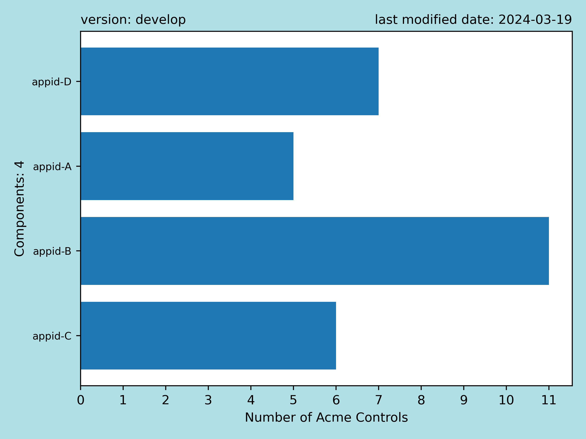

# oscal-insights

## Acme

##### *Component Definition for Acme*

Click to view [OSCAL component-definition.json](component-definitions/acme-component-definition/component-definition.json)

##### *Catalog for Acme*

Click to view [OSCAL catalog.json](catalogs/acme-catalog-nist-800-53/catalog.json)

---
---

<table>
<tr>
<td> Acme Controls covered by at least one Component (e.g. service/process/software)
<tr>
<td>
</table>

###### Description

Of the total number of controls in the Acme catalog,
the number of controls that have at least one `rule` specified in the component definition vs. the number of controls that have zero.

A control is `covered` if it has at least one `rule` specified.

---
---

<table>
<tr>
<td> Acme Controls coverage by Components (e.g. service/process/software)
<tr>
<td>
</table>

###### Description

Of the `covered` controls, the number of components that have `coverage` for each control.

---
---

<table>
<tr>
<td> Components implementations of Acme Controls
<tr>
<td>
</table>

###### Description

Of the `covered` controls, the number of controls that have `coverage` for each component.

---
---

<table>
<tr>
<td> Component rules with assessment check validation (percentage)
<tr>
<td>
</table>

###### Description

For all the validation rules specified in the component definition, the percentage that have a corresponding check for each component.

---
---

<table>
<tr>
<td> Validation rules and assessment checks counts
<tr>
<td>
</table>

###### Description

The total number of validation rules, the number of checks that are unique for those rules, and the number of checks that are re-used for those rules.

---
---

<table>
<tr>
<td> Acme implementations existence
<tr>
<td>
</table>

###### Description

Of the total validation rules in the component definition,
the percentage that have at least one `implementation` vs. the percentage that have none.
